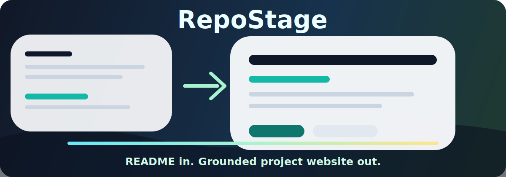
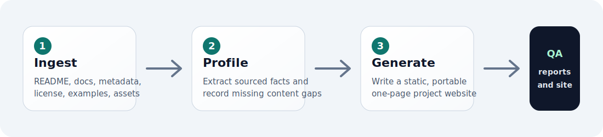

<p align="center">
  
</p>

<p align="center">
  <a href="LICENSE"></a>
  
  
  
</p>

<p align="center">
  <a href="README.md">English</a> | 中文
</p>

# RepoStage

RepoStage 是一个给 agent 使用的 skill，可以把公开 GitHub 仓库生成一个有依据的一页式 landing page。

它主要面向 Claude、Codex 等 coding agent 使用。你只需要让 agent 安装这个 skill，然后让它帮你为某个仓库生成 landing page。

## 安装

告诉你的 agent：

```text
帮我安装 repo-stage skill: https://github.com/Wenfeng-GAO/repo-stage
```

如果 agent 需要更具体的路径，告诉它安装这个目录：

```text
skills/repo-stage
```

正常使用不需要你手动配置 npm、pip 或本地 CLI。

## 使用

可以用 skill 名称直接调用：

```text
$repo-stage 帮我为 https://github.com/owner/repo 生成 landing page
```

也可以直接用自然语言告诉 agent：

```text
使用 repo-stage 帮我为 https://github.com/owner/repo 生成 landing page
```

```text
使用 repo-stage 帮我为 https://github.com/owner/repo 生成一个适合 GitHub Pages 的项目主页
```

你也可以补充这些要求：

- 输出目录，例如 `./generated/owner-repo`
- 视觉方向，例如 `minimal`、`technical`、`editorial`、`playful`
- 目标受众，例如开发者、维护者、贡献者，或正在评估项目的用户

## 输出内容

RepoStage 会让 agent 生成这样的输出结构：

```text
generated/owner-repo/
  site/
    index.html
    styles.css
    assets/
  repo-profile.json
  README-gap-report.md
  validation-report.md
```

生成的 `site/` 是静态 HTML/CSS，可以本地打开，也可以提交到仓库，或改造成 GitHub Pages 页面。

<p align="center">
  
</p>

## 为什么使用 RepoStage

- **适合 agent 使用：** 直接让 Claude、Codex 或其他 coding agent 安装并调用。
- **内容有依据：** 页面文案来自仓库文件和元数据，而不是凭空生成营销话术。
- **快速得到首页：** 不需要手写 landing page，就能把已有公开仓库变成清晰的项目页。
- **给维护者反馈：** 自动指出缺失的安装说明、示例、截图、许可证信息和定位问题。
- **输出可迁移：** 保留静态站点、结构化 profile、gap report 和 validation report。

`GITHUB_TOKEN` 是可选的。公开仓库通常可以不配置 token；如果触发 GitHub 未认证请求限制，agent 应该说明降级路径。

## 开发者说明

可复用的 skill 位于 [skills/repo-stage/SKILL.md](skills/repo-stage/SKILL.md)。它面向能 clone 仓库、读写文件、运行本地命令的 coding agent。

仓库内也包含用于开发和 fixture 测试的本地 helper：

```bash
python3 skills/repo-stage/scripts/repo_stage_generate.py \
  --repo-path examples/fixtures/tiny-cli-tool \
  --repo-url https://github.com/example/tiny-cli-tool \
  --out examples/outputs/tiny-cli-tool

python3 skills/repo-stage/scripts/validate_output.py examples/outputs/tiny-cli-tool
```

也可以使用 Node profile/site 工具处理 fixture：

```bash
npm run generate:profile -- --input fixtures/ingestion/complete.json --out repo-profile.json
npm run validate:profile -- repo-profile.json
npm run generate:site -- --profile fixtures/profiles/repo-stage/repo-profile.json --out generated/repo-stage
npm test
```

## 文档

- [Product design](docs/product-design.md)
- [Development plan](docs/development-plan.md)
- [Skill specification](docs/skill-spec.md)
- [Repo profile schema](docs/repo-profile-schema.md)
- [Quality checklist](docs/quality-checklist.md)
- [Agent compatibility](docs/agent-compatibility.md)
- [Ingestion details](docs/ingestion.md)

## 状态

RepoStage 目前是本地 MVP 原型。它可以检查公开 GitHub 仓库，生成 `repo-profile.json`，生成静态一页式站点，并创建 README gap report 和 validation report。它还不是托管 SaaS、可视化编辑器、pitch deck 生成器或完整的发布资产套件。

## License

Apache-2.0
